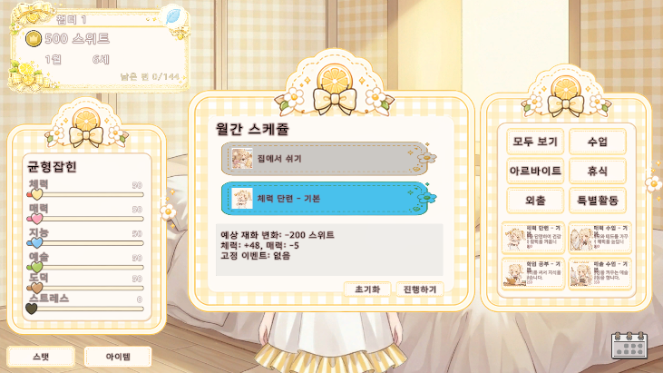

# Dessert Princess

2D 비주얼 노벨 감성의 육성 시뮬레이션 게임입니다. Unity로 플레이 화면을 구현하면서도 핵심 게임 규칙은 순수 C# Core로 분리해, Unity Editor 없이도 콘솔 시뮬레이션에서 성장 흐름, 이벤트 발생, 엔딩 조건, 경제 밸런스를 검증할 수 있도록 설계했습니다.

[GitHub Repository](https://github.com/sum1932/PrincessGrow)

## 프로젝트 요약

- 개발 기간: 2026.03.27 - 2026.05.31
- 장르: 2D, 비주얼 노벨, 육성 시뮬레이션, 캐주얼
- 엔진: Unity 6 (`6000.2.15f1`)
- 언어: C#
- 구조: Headless POCO, Clean Architecture, Ports & Adapters
- 데이터: CSV / JSON 기반 데이터 주도 설계
- 자동화: Random strategy, LLM strategy 기반 플레이 시뮬레이션

## 담당 역할

- 월 단위 성장, 스탯, 경제, 이벤트, 엔딩 판정 등 Core 게임 로직 설계 및 구현
- Unity 의존성을 제거한 순수 C# 도메인/서비스 계층 구성
- Core와 Unity UI를 연결하는 Presenter/Input 인터페이스 설계
- CSV/JSON Repository 기반 콘텐츠 데이터 파이프라인 구현
- 자동 플레이 시뮬레이션 및 LLM 플레이어 전략 구현

## 화면

### Main Menu

### Monthly Schedule

### Monthly Result

## 기술 포인트

### 1. Unity-independent Core

게임의 핵심 규칙을 `MonoBehaviour`나 Unity API에 직접 의존하지 않도록 분리했습니다. 덕분에 Unity Editor를 실행하지 않아도 콘솔 프로젝트에서 월 진행, 스탯 변화, 이벤트 발생, 엔딩 판정을 빠르게 검증할 수 있습니다.

Code references:

- [`GameState.cs`](https://github.com/sum1932/PrincessGrow/blob/main/Assets/Scripts/Core/Domain/GameState.cs)
- [`TurnManager.cs`](https://github.com/sum1932/PrincessGrow/blob/main/Assets/Scripts/Core/Services/TurnManager.cs)
- [`EventManager.cs`](https://github.com/sum1932/PrincessGrow/blob/main/Assets/Scripts/Core/Services/EventManager.cs)
- [`EndingJudge.cs`](https://github.com/sum1932/PrincessGrow/blob/main/Assets/Scripts/Core/Services/EndingJudge.cs)

### 2. Ports & Adapters

Core 로직은 화면 표시나 입력 장치를 알지 못하고, `IGamePresenter`와 `IGameInput` 같은 인터페이스만 통해 외부와 연결됩니다. Unity 쪽 구현체는 Core 상태를 UI View와 UnityEvent로 변환하는 어댑터 역할만 담당합니다.

Code references:

- [`IGamePresenter.cs`](https://github.com/sum1932/PrincessGrow/blob/main/Assets/Scripts/Adapters/Interfaces/IGamePresenter.cs)
- [`IGameInput.cs`](https://github.com/sum1932/PrincessGrow/blob/main/Assets/Scripts/Adapters/Interfaces/IGameInput.cs)
- [`UnityGamePresenter.cs`](https://github.com/sum1932/PrincessGrow/blob/main/Assets/Scripts/Adapters/Unity/UnityGamePresenter.cs)
- [`GameController.cs`](https://github.com/sum1932/PrincessGrow/blob/main/Assets/Scripts/Controllers/GameController.cs)

### 3. Data-driven Content

행동, 이벤트, 엔딩, NPC 대화, 아이템 데이터를 코드에 하드코딩하지 않고 CSV/JSON 및 ScriptableObject 데이터베이스로 관리했습니다. 기획 데이터가 수정되면 Repository/Converter 계층을 통해 게임에 반영되도록 구성했습니다.

Code references:

- [`IRepositories.cs`](https://github.com/sum1932/PrincessGrow/blob/main/Assets/Scripts/Core/Data/IRepositories.cs)
- [`CsvActivityRepository.cs`](https://github.com/sum1932/PrincessGrow/blob/main/Assets/Scripts/Core/Data/CsvActivityRepository.cs)
- [`DatabaseActionRepository.cs`](https://github.com/sum1932/PrincessGrow/blob/main/Assets/Scripts/Repositories/DatabaseActionRepository.cs)
- [`ExcelConverter`](https://github.com/sum1932/PrincessGrow/tree/main/Assets/Scripts/ExcelConverter)

### 4. Automated Simulation and LLM Playtesting

`ISimulationStrategy`를 통해 랜덤 전략, 인터랙티브 전략, LLM 전략을 교체할 수 있게 만들었습니다. 한 번의 전체 플레이 흐름을 자동 실행하면서 엔딩 분포, 스탯 변화, 경제 밸런스, 이벤트 선택 흐름을 빠르게 확인할 수 있습니다.

Code references:

- [`GameSimulator.cs`](https://github.com/sum1932/PrincessGrow/blob/main/Implementation/Simulation/GameSimulator.cs)
- [`LLMStrategy.cs`](https://github.com/sum1932/PrincessGrow/blob/main/Implementation/TestConsole/LLMStrategy.cs)
- [`ILLMClient.cs`](https://github.com/sum1932/PrincessGrow/blob/main/Implementation/TestConsole/ILLMClient.cs)
- [`OpenAIClient.cs`](https://github.com/sum1932/PrincessGrow/blob/main/Implementation/TestConsole/OpenAIClient.cs)
- [`GeminiClient.cs`](https://github.com/sum1932/PrincessGrow/blob/main/Implementation/TestConsole/GeminiClient.cs)
- [`KimiClient.cs`](https://github.com/sum1932/PrincessGrow/blob/main/Implementation/TestConsole/KimiClient.cs)

## 이 프로젝트에서 보여주고 싶은 점

- Unity 프로젝트에서 게임 로직과 View 계층을 분리하는 설계 역량
- CSV/JSON 기반 데이터 파이프라인을 통한 콘텐츠 확장성
- 자동 플레이 시뮬레이션으로 밸런스와 QA를 보조하는 개발 방식
- LLM을 게임 플레이 테스트에 연결하는 실험적 구현 경험
- 포트폴리오에서 코드 근거를 함께 제시할 수 있는 구조화된 저장소 관리
